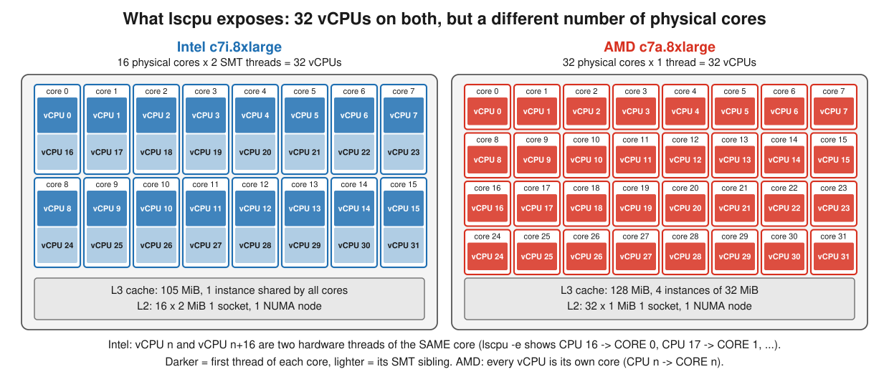
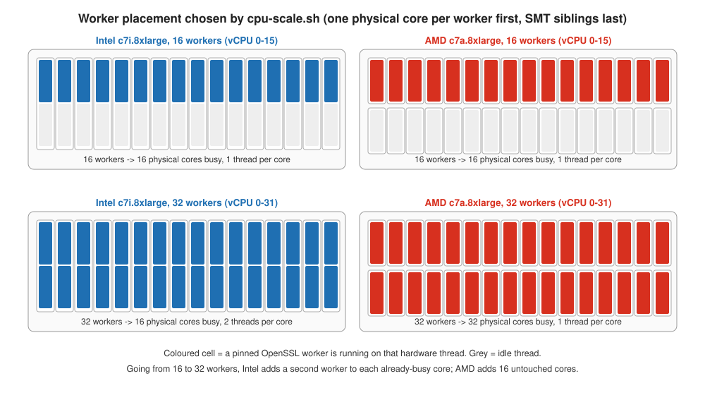
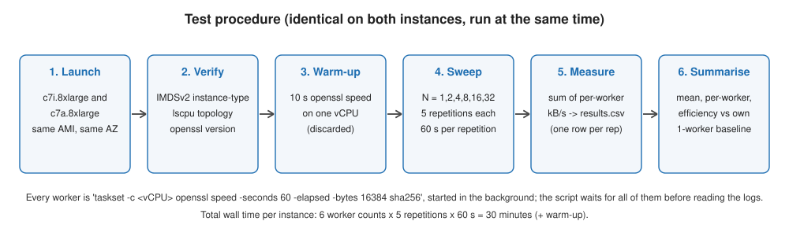
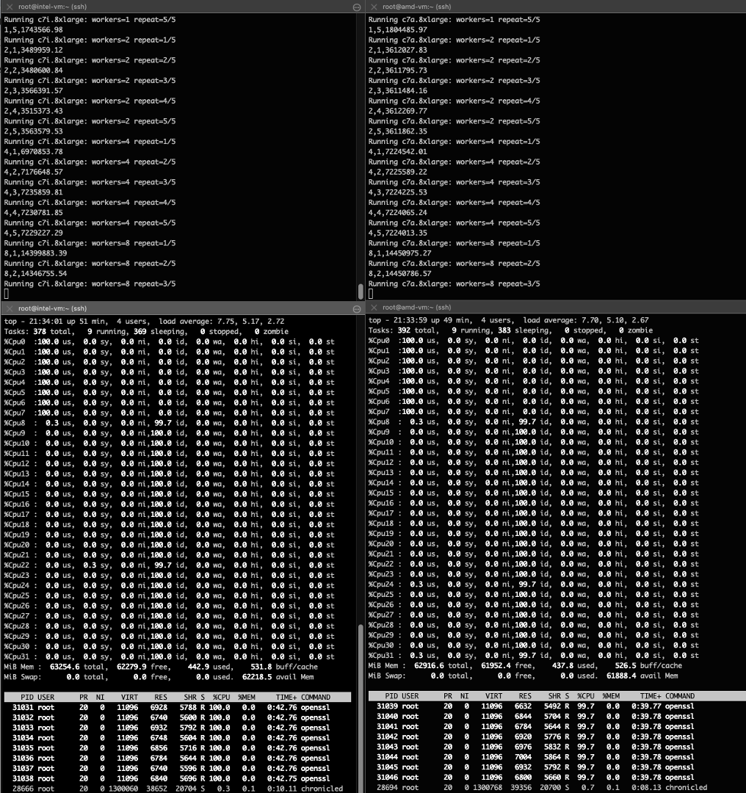
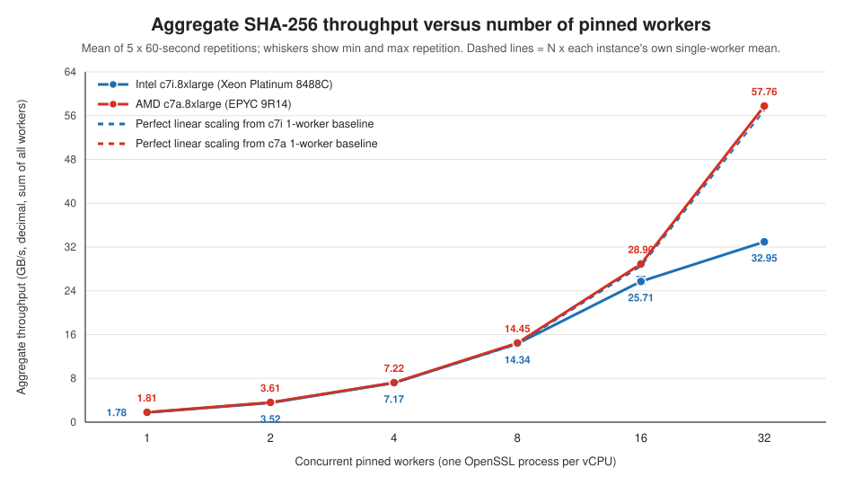
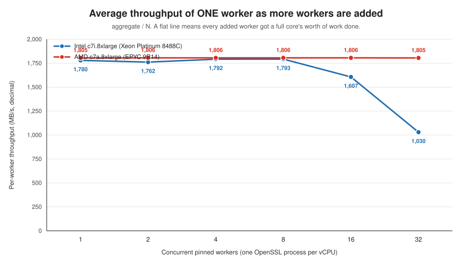
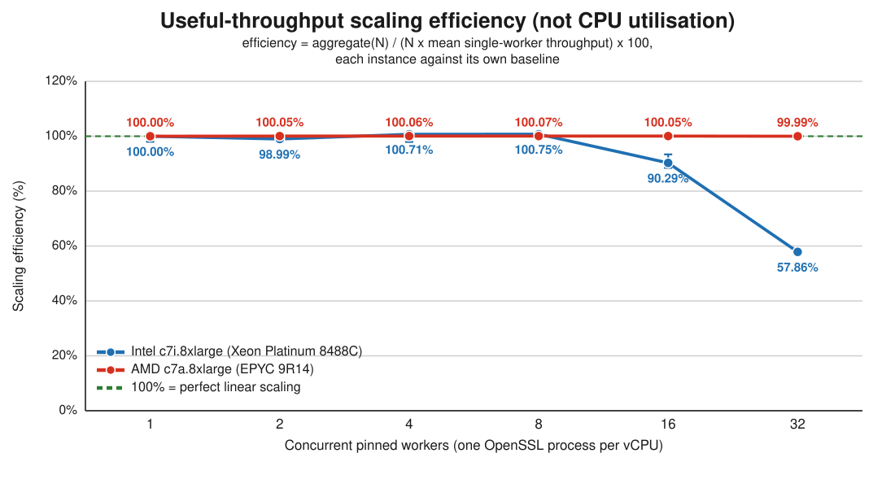
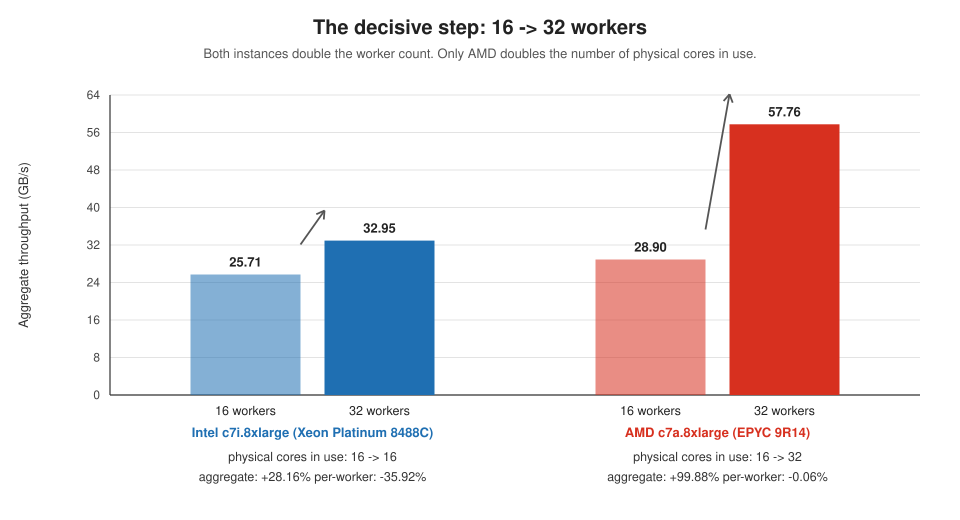

# 32 vCPUs are not always 32 cores: measuring CPU scaling on AMD `c7a.8xlarge` versus Intel `c7i.8xlarge`

A reproducible experiment showing why two EC2 instances with the **same vCPU count** can deliver very different **total throughput** once every vCPU is busy, and why "CPU utilisation is 100%" tells you nothing about how much useful work is being done.

| | Intel `c7i.8xlarge` | AMD `c7a.8xlarge` |
|---|---:|---:|
| vCPUs exposed to the guest | 32 | 32 |
| Physical cores behind them | **16** | **32** |
| Hardware threads per core | 2 (SMT / Hyper-Threading) | 1 |
| Aggregate SHA-256 throughput, 32 workers | 32.95 GB/s | 57.76 GB/s |
| Scaling efficiency at 32 workers | **57.86 %** | **99.99 %** |

Everything needed to check or redo this work is in this repository: the benchmark script, every raw measurement, the exact topology and software versions of both machines, and the script that regenerates every chart from the raw CSV files.

---

## Table of contents

1. [Why this test exists](#1-why-this-test-exists)
2. [The question, stated precisely](#2-the-question-stated-precisely)
3. [Environments and resources, and why they were chosen](#3-environments-and-resources-and-why-they-were-chosen)
4. [The workload and how the measurement works](#4-the-workload-and-how-the-measurement-works)
5. [Step-by-step procedure (reproduce it yourself)](#5-step-by-step-procedure-reproduce-it-yourself)
6. [Results](#6-results)
7. [Interpretation](#7-interpretation)
8. [Notices, caveats and what this does not prove](#8-notices-caveats-and-what-this-does-not-prove)
9. [Conclusion](#9-conclusion)
10. [Repository layout and how to regenerate the figures](#10-repository-layout-and-how-to-regenerate-the-figures)
11. [Appendix A: pitfalls met during the run](#appendix-a-pitfalls-met-during-the-run)
12. [Appendix B: full raw data](#appendix-b-full-raw-data)

---

## 1. Why this test exists

A common capacity-planning assumption is: *"an instance with 32 vCPUs can do 32 units of work at once, so if I split my job into 32 independent workers it will finish 32 times faster than one worker"*.

That assumption silently depends on **what a vCPU is**. On EC2 a vCPU is one *hardware thread*. On Intel-based instance families such as `c7i`, a physical core is split into two hardware threads (Intel Hyper-Threading, the generic term is SMT, Simultaneous Multi-Threading), so 32 vCPUs are backed by 16 physical cores. On the AMD-based `c7a` family, EC2 exposes one thread per core, so 32 vCPUs are backed by 32 physical cores.

Two hardware threads of the same core **share** that core's execution units, L1 and L2 caches and front end. SMT lets one thread use the core while the other is stalled (waiting on memory, a branch, a dependency). When both threads are running code that keeps the execution units busy all the time, there is little idle capacity for the second thread to pick up, and the two threads mostly take turns. The result is that each thread runs at a fraction of the speed it would have alone, while the operating system still reports **both** vCPUs as 100 % utilised.

This repository measures exactly that effect with a controlled, CPU-bound workload, on two instances that are as identical as EC2 allows apart from the processor.

## 2. The question, stated precisely

> If I run N independent, CPU-bound workers, each pinned to its own vCPU, how does the **total useful throughput** grow with N on each instance, and how much of the "advertised" capacity (N times one worker) do I actually get once all 32 vCPUs are busy?

The metric is **scaling efficiency**:

```text
                       aggregate throughput with N workers
scaling efficiency(N) = ------------------------------------------- x 100
                        N x (average throughput of ONE worker alone)
```

- 100 % means every added worker contributed as much as a lone worker on an idle machine: perfect linear scaling.
- 50 % means that with N workers you get only half of N times a single worker.

Each instance is compared against **its own** single-worker baseline, so this metric isolates *how the machine scales* from *how fast one core is*. Absolute throughput is reported separately so the reader can also compare raw speed.

**Scaling efficiency is not CPU utilisation.** During the 32-worker runs `top` reports every vCPU at ~100 % on both instances. Utilisation measures whether a vCPU had a runnable task; it does not measure how much work that task completed.

## 3. Environments and resources, and why they were chosen

### 3.1 The two instances

Both instances were launched in the same Availability Zone, from the same AMI, at the same time, and the benchmark was started on both within one second of each other (run IDs `20261006T211608Z` and `20261006T211609Z`). Everything that could be held equal was held equal:

| Control | Intel `c7i.8xlarge` | AMD `c7a.8xlarge` | Same? |
|---|---|---|:-:|
| Region / AZ | `us-east-1c` | `us-east-1c` | yes |
| AMI | `ami-0d27e0fb3bac4d724` | `ami-0d27e0fb3bac4d724` | yes |
| OS | Amazon Linux 2023.12.20260930 | Amazon Linux 2023.12.20260930 | yes |
| Kernel | `6.18.51-120.163.amzn2023.x86_64` | `6.18.51-120.163.amzn2023.x86_64` | yes |
| OpenSSL package | `openssl-3.5.8-1.amzn2023.0.1.x86_64` | `openssl-3.5.8-1.amzn2023.0.1.x86_64` | yes |
| vCPUs | 32 | 32 | yes |
| Memory | 64 GiB | 64 GiB | yes |
| Sockets / NUMA nodes | 1 / 1 | 1 / 1 | yes |
| Hypervisor | Nitro (KVM reported by guest) | Nitro (KVM reported by guest) | yes |
| **Processor** | Intel Xeon Platinum 8488C (Sapphire Rapids) | AMD EPYC 9R14 (Genoa) | **no** |
| **Physical cores** | **16** | **32** | **no** |
| **Threads per core** | **2** | **1** | **no** |
| L2 cache | 16 x 2 MiB | 32 x 1 MiB | no |
| L3 cache | 105 MiB, 1 instance | 128 MiB, 4 instances | no |

Evidence: [`results/c7i.8xlarge/environment.txt`](results/c7i.8xlarge/environment.txt), [`results/c7a.8xlarge/environment.txt`](results/c7a.8xlarge/environment.txt), and the `=== CPU summary ===` block of each `system-info.txt`.

**Why `c7i.8xlarge` and `c7a.8xlarge`?**

- Same generation (7th), same family role (compute optimised), same size (`8xlarge` = 32 vCPUs, 64 GiB). This is the pair a customer would naturally compare when choosing between Intel and AMD.
- `c7a` is one of the EC2 families where AWS exposes **one thread per core**, so it is the cleanest available "32 real cores" reference against a "16 cores x 2 threads" instance of identical size.
- Both have a single socket and a single NUMA node in the guest, which removes NUMA placement as a variable.
- Both processors report the `sha_ni` CPU flag, so OpenSSL uses the hardware SHA extensions on both (see section 8 for why this matters).

### 3.2 Guest-visible topology

`lscpu -e=CPU,CORE,SOCKET,NODE,ONLINE` is the ground truth for which vCPU belongs to which physical core:

<table>
<tr><th>Intel c7i.8xlarge</th><th>AMD c7a.8xlarge</th></tr>
<tr><td>

```text
CPU CORE SOCKET NODE ONLINE
  0    0      0    0    yes
  1    1      0    0    yes
 ...
 15   15      0    0    yes
 16    0      0    0    yes   <- sibling of CPU 0
 17    1      0    0    yes   <- sibling of CPU 1
 ...
 31   15      0    0    yes   <- sibling of CPU 15
```

</td><td>

```text
CPU CORE SOCKET NODE ONLINE
  0    0      0    0    yes
  1    1      0    0    yes
 ...
 15   15      0    0    yes
 16   16      0    0    yes   <- its own core
 17   17      0    0    yes
 ...
 31   31      0    0    yes
```

</td></tr>
</table>

On Intel, vCPU *n* and vCPU *n+16* are the two hardware threads of core *n*. On AMD every vCPU is a distinct core. Full tables: `results/*/system-info.txt`.



### 3.3 Software

| Component | Value | Why it matters |
|---|---|---|
| Benchmark driver | [`scripts/cpu-scale.sh`](scripts/cpu-scale.sh) (Bash) | Deterministic worker placement, raw logs kept, summary computed with `awk` |
| Workload | `openssl speed -elapsed -bytes 16384 sha256` | Pure CPU, no I/O, no memory-bandwidth dependence, no inter-process communication |
| Pinning | `taskset -c <vCPU>` | Prevents the scheduler from migrating workers and guarantees that SMT siblings are only used after every physical core already has one worker |
| Instance metadata | IMDSv2 (`169.254.169.254`) | Script names its output directory after the real instance type |

Both instances ran the **same binary build** of OpenSSL (`openssl version -a` is captured in each `system-info.txt`, including the compiler flags and the `OPENSSL_ia32cap` feature mask).

## 4. The workload and how the measurement works

### 4.1 One worker

A single worker is:

```bash
taskset -c "$CPU" openssl speed -seconds 60 -elapsed -bytes 16384 sha256
```

- `openssl speed` hashes a 16,384-byte buffer in a tight loop for 60 seconds and reports how many bytes per second it processed.
- `-elapsed` measures wall-clock time instead of process CPU time. This matters: with SMT, a thread can be "on CPU" according to the kernel while making slow progress. Wall-clock throughput is what the user experiences.
- `-bytes 16384` fixes a single, large block size so the measurement is dominated by the hash computation itself rather than per-call overhead.
- OpenSSL prints throughput as, for example, `1794782.28k`, meaning **thousands of bytes per second** (decimal kilobytes). All figures in this article use that unit; "GB/s" means 10^9 bytes per second.

### 4.2 N workers

For a given worker count N, the script starts N such processes **simultaneously**, each pinned to a different vCPU, waits for all of them, reads each worker's final throughput line, and **sums** them. That sum is the aggregate throughput for that repetition. Each N is repeated 5 times and the mean is reported.

### 4.3 Which vCPUs get a worker

The script orders the vCPUs so that **one logical CPU from every physical core comes first, and SMT siblings come last**. This is derived from `lscpu -p=CPU,CORE,SOCKET` at run time, not hard-coded:

```bash
mapfile -t ORDERED_CPUS < <(
    lscpu -p=CPU,CORE,SOCKET |
    awk -F, '
        !/^#/ {
            key=$3 ":" $2
            if (!(key in seen)) { seen[key]=1; primary[++p]=$1 }
            else                { sibling[++s]=$1 }
        }
        END {
            for (i=1;i<=p;i++) print primary[i]
            for (i=1;i<=s;i++) print sibling[i]
        }'
)
```

On both machines this produced `0 1 2 ... 31` (recorded as `ordered_cpus=` in `system-info.txt`), but the *meaning* differs:

| Workers | Intel vCPUs used | Intel physical cores busy | AMD vCPUs used | AMD physical cores busy |
|---:|---|---:|---|---:|
| 1 | 0 | 1 | 0 | 1 |
| 8 | 0-7 | 8 | 0-7 | 8 |
| 16 | 0-15 | 16 (one thread each) | 0-15 | 16 |
| 32 | 0-31 | 16 (**two threads each**) | 0-31 | **32** |



This placement is deliberate. It mirrors what the Linux scheduler prefers to do anyway (spread across cores before doubling up on a core), but makes it deterministic, so the 16-worker and 32-worker measurements on Intel differ by exactly one thing: whether the second hardware thread of each core is also loaded.

### 4.4 Settings used for the published run

| Setting | Value | Why |
|---|---|---|
| Worker counts | 1, 2, 4, 8, 16, 32 | Doubling steps; 16 and 32 straddle the Intel SMT boundary |
| Duration per repetition | 60 s | Long enough to average out frequency transitions and timer granularity |
| Repetitions per worker count | 5 | Enables a min/max spread check for every point |
| Warm-up | 10 s on vCPU 0, discarded | Lets the governor and caches settle before the first measured run |
| Total wall time per instance | 6 x 5 x 60 s = 30 min (+ warm-up) | Both instances ran concurrently |



## 5. Step-by-step procedure (reproduce it yourself)

Every step below shows the command and the output that was actually observed. The two instances were worked on in parallel from two terminals (`[root@intel-vm ~]#` and `[root@amd-vm ~]#`).

### Step 1. Launch the two instances

Launch one `c7i.8xlarge` and one `c7a.8xlarge` in the **same Availability Zone** from the **same Amazon Linux 2023 AMI**. Either use the EC2 console or the CLI:

```bash
# Repeat with --instance-type c7a.8xlarge
aws ec2 run-instances \
    --image-id ami-0d27e0fb3bac4d724 \
    --instance-type c7i.8xlarge \
    --subnet-id <subnet-in-us-east-1c> \
    --iam-instance-profile Name=<profile-with-AmazonSSMManagedInstanceCore> \
    --tag-specifications 'ResourceType=instance,Tags=[{Key=Name,Value=intel-vm}]'
```

An IAM instance profile with `AmazonSSMManagedInstanceCore` lets you connect with Session Manager, which is what was used here (no SSH key or open port 22 needed). Nothing else needs to be installed: `openssl`, `taskset` (util-linux), `lscpu`, `awk` and `curl` are all part of the base AL2023 image.

### Step 2. Verify what you got

Query IMDSv2 for the instance type and look at the topology:

```bash
TOKEN=$(curl --noproxy '*' -sS -X PUT \
    -H "X-aws-ec2-metadata-token-ttl-seconds: 21600" \
    "http://169.254.169.254/latest/api/token")

INSTANCE_TYPE=$(curl --noproxy '*' -sS \
    -H "X-aws-ec2-metadata-token: $TOKEN" \
    "http://169.254.169.254/latest/meta-data/instance-type")

echo "Instance type: $INSTANCE_TYPE"
lscpu | grep -E 'Architecture|^CPU\(s\)|Model name|Vendor ID|Socket|Core|Thread|NUMA'
```

Observed on the Intel instance:

```text
Instance type: c7i.8xlarge
Architecture:                            x86_64
CPU(s):                                  32
Vendor ID:                               GenuineIntel
Model name:                              Intel(R) Xeon(R) Platinum 8488C
Thread(s) per core:                      2
Core(s) per socket:                      16
Socket(s):                               1
NUMA node(s):                            1
NUMA node0 CPU(s):                       0-31
```

Observed on the AMD instance:

```text
Instance type: c7a.8xlarge
Architecture:                            x86_64
CPU(s):                                  32
Vendor ID:                               AuthenticAMD
Model name:                              AMD EPYC 9R14
Thread(s) per core:                      1
Core(s) per socket:                      32
Socket(s):                               1
NUMA node(s):                            1
NUMA node0 CPU(s):                       0-31
```

Then dump the per-vCPU mapping (this is what the script will use):

```bash
lscpu -e=CPU,CORE,SOCKET,NODE,ONLINE
```

The full outputs are in [`results/c7i.8xlarge/system-info.txt`](results/c7i.8xlarge/system-info.txt) and [`results/c7a.8xlarge/system-info.txt`](results/c7a.8xlarge/system-info.txt). The key line to confirm on Intel is `16    0      0    0    yes`: vCPU 16 lives on core 0.

### Step 3. Install the benchmark script

Copy [`scripts/cpu-scale.sh`](scripts/cpu-scale.sh) to `/root/cpu-scale.sh` on **both** instances (paste it through the Session Manager terminal with a heredoc, or `aws s3 cp`), then:

```bash
chmod 700 /root/cpu-scale.sh
bash -n /root/cpu-scale.sh && echo "Syntax OK"
```

```text
Syntax OK
```

### Step 4. Start the benchmark on both instances

Run it under `nohup` so a dropped Session Manager connection cannot kill a 30-minute run, and record the PID:

```bash
nohup env DURATION=60 REPEATS=5 /root/cpu-scale.sh \
    > /root/cpu-scale-console.log 2>&1 &
echo $! | tee /root/cpu-scale.pid
```

Start it on the second instance immediately afterwards. In this run the two started one second apart (21:16:08Z and 21:16:09Z), so both machines experienced the same 30 minutes of the day.

**Run only one copy per instance.** A second benchmark on the same machine would steal cycles from the single-worker baseline and invalidate every efficiency number.

### Step 5. Monitor (optional, from a second terminal)

```bash
tail -f /root/cpu-scale-console.log
```

```text
Instance type: c7i.8xlarge
Logical CPUs: 32
Worker counts: 1 2 4 8 16 32
Duration per repetition: 60 seconds
Repetitions per worker count: 5
Output directory: /root/cpu-comparison-c7i.8xlarge-20261006T211608Z
Latest-results link: /root/cpu-comparison-c7i.8xlarge-latest

Running 10-second warm-up...
Warm-up complete.

Running c7i.8xlarge: workers=1 repeat=1/5
1,1,1794782.28
Running c7i.8xlarge: workers=1 repeat=2/5
...
```

During the 1-worker stage `top` confirmed the pinning: exactly one vCPU at 100 % user time, all others idle, one `openssl` process at 100 %:

```text
top - 21:20:06 up 37 min,  4 users,  load average: 1.09, 0.62, 0.26
%Cpu0  :100.0 us,  0.0 sy,  0.0 ni,  0.0 id, ...
%Cpu1  :  0.0 us,  0.0 sy,  0.0 ni,100.0 id, ...
%Cpu2  :  0.0 us,  0.0 sy,  0.0 ni,100.0 id, ...
...   (CPUs 3-31 idle)
    PID USER      PR  NI    VIRT    RES    SHR S  %CPU  %MEM     TIME+ COMMAND
  30425 root      20   0   11096   6800   5660 R 100.0   0.0   0:48.63 openssl
```

Useful one-liners while it runs:

```bash
pgrep -c -x openssl                                   # how many workers right now
ps -C openssl -o pid,psr,pcpu,etime,comm --sort=psr   # which vCPU (PSR) each one is on
```

Avoid heavy monitoring tools during the run; `top`, `ps`, `tail` are fine.

The screenshot below was taken during the 8-worker stage, Intel on the left and AMD on the right, two seconds apart (21:34:01 and 21:33:59). The upper panes are the console logs; the lower panes are `top` on each instance:



Three things are visible:

- `Cpu0` to `Cpu7` are at 100 % user time and `Cpu8` to `Cpu31` are idle on **both** instances, so pinning worked and the worker placement was identical on the two machines.
- Exactly eight `openssl` processes are running, each at ~100 % of one vCPU (`100.0` on Intel, `99.7` on AMD).
- The two `top` views are indistinguishable, yet behind them the Intel instance is using 8 of its 16 physical cores and the AMD instance 8 of its 32. `%CPU` says nothing about how much hardware sits behind a busy vCPU, which is the theme of section 7.4.

### Step 6. Read the results

When the console log prints `=== BENCHMARK COMPLETE ===`, display the summary:

```bash
column -s, -t /root/cpu-comparison-c7i.8xlarge-latest/summary.csv
```

```text
workers  avg_aggregate_kBps  avg_per_worker_kBps  scaling_efficiency_pct
1        1779540.57          1779540.57           100.00
2        3523180.90          1761590.45           98.99
4        7168674.26          1792168.56           100.71
8        14343205.16         1792900.65           100.75
16       25709362.65         1606835.17           90.29
32       32949304.25         1029665.76           57.86
```

```bash
column -s, -t /root/cpu-comparison-c7a.8xlarge-latest/summary.csv
```

```text
workers  avg_aggregate_kBps  avg_per_worker_kBps  scaling_efficiency_pct
1        1805103.10          1805103.10           100.00
2        3611887.97          1805943.98           100.05
4        7224487.07          1806121.77           100.06
8        14450425.86         1806303.23           100.07
16       28896231.38         1806014.46           100.05
32       57756489.82         1804890.31           99.99
```

### Step 7. Collect the evidence before terminating the instances

Each run directory contains `results.csv` (one row per repetition), `summary.csv`, `system-info.txt` and `raw/` (every worker's OpenSSL log). Also record the environment with [`scripts/collect-environment.sh`](scripts/collect-environment.sh):

```bash
/root/collect-environment.sh
```

```text
=== EC2 identity ===
Instance type: c7i.8xlarge
AMI ID: ami-0d27e0fb3bac4d724
Availability Zone: us-east-1c

=== Operating system ===
PRETTY_NAME="Amazon Linux 2023.12.20260930"
...
=== Kernel ===
Linux intel-vm 6.18.51-120.163.amzn2023.x86_64 #2 SMP PREEMPT_DYNAMIC Fri Sep 25 01:45:40 UTC 2026 x86_64 GNU/Linux

=== Packages ===
openssl-3.5.8-1.amzn2023.0.1.x86_64
```

The AMD output was identical apart from the instance type and host name. Copy everything off the instance (`aws s3 cp --recursive`, or just `cat` the files through the terminal as was done here) and store it alongside the article. All of it is under [`results/`](results/).

## 6. Results

### 6.1 Aggregate throughput

Mean of five 60-second repetitions. Whiskers in the chart show the minimum and maximum repetition.

| Workers | Intel `c7i.8xlarge` (kB/s) | AMD `c7a.8xlarge` (kB/s) | AMD advantage |
|---:|---:|---:|---:|
| 1 | 1,779,540.57 | 1,805,103.10 | +1.44 % |
| 2 | 3,523,180.90 | 3,611,887.97 | +2.52 % |
| 4 | 7,168,674.26 | 7,224,487.07 | +0.78 % |
| 8 | 14,343,205.16 | 14,450,425.86 | +0.75 % |
| 16 | 25,709,362.65 | 28,896,231.38 | +12.40 % |
| 32 | 32,949,304.25 | 57,756,489.82 | **+75.29 %** |



Through 8 workers the two machines are within about 2.5 % of each other. The curves separate at 16 workers and diverge sharply at 32.

### 6.2 Per-worker throughput

`aggregate / N`. This is how fast *one* worker runs while N-1 others are also running.

| Workers | Intel (kB/s per worker) | AMD (kB/s per worker) |
|---:|---:|---:|
| 1 | 1,779,540.57 | 1,805,103.10 |
| 2 | 1,761,590.45 | 1,805,943.98 |
| 4 | 1,792,168.56 | 1,806,121.77 |
| 8 | 1,792,900.65 | 1,806,303.23 |
| 16 | 1,606,835.17 | 1,806,014.46 |
| 32 | **1,029,665.76** | **1,804,890.31** |



On AMD a worker is just as fast with 31 neighbours as it is alone (1,804,890 vs 1,805,103 kB/s, a 0.01 % difference). On Intel a worker at 32-wide load runs at 57.9 % of its solo speed.

### 6.3 Scaling efficiency

| Workers | Intel efficiency | AMD efficiency |
|---:|---:|---:|
| 1 | 100.00 % | 100.00 % |
| 2 | 98.99 % | 100.05 % |
| 4 | 100.71 % | 100.06 % |
| 8 | 100.75 % | 100.07 % |
| 16 | 90.29 % | 100.05 % |
| 32 | **57.86 %** | **99.99 %** |



Worked example for the Intel 32-worker row, so the formula is concrete:

```text
baseline            = mean of the five 1-worker runs = 1,779,540.57 kB/s
ideal at 32 workers = 32 x 1,779,540.57            = 56,945,298.24 kB/s
measured at 32      =                                 32,949,304.25 kB/s
efficiency          = 32,949,304.25 / 56,945,298.24  = 0.5786  ->  57.86 %
```

Same calculation for AMD: `57,756,489.82 / (32 x 1,805,103.10) = 0.9999 -> 99.99 %`.

### 6.4 The decisive step: 16 to 32 workers

Both instances double the number of workers. Only one of them doubles the number of physical cores doing the work.

| 16 -> 32 workers | Intel `c7i.8xlarge` | AMD `c7a.8xlarge` |
|---|---:|---:|
| Physical cores busy | 16 -> 16 | 16 -> 32 |
| Aggregate throughput | 25.71 -> 32.95 GB/s (**+28.16 %**) | 28.90 -> 57.76 GB/s (**+99.88 %**) |
| Per-worker throughput | 1,606,835 -> 1,029,666 kB/s (**-35.92 %**) | 1,806,014 -> 1,804,890 kB/s (-0.06 %) |
| Throughput added by the 16 new workers | 7,239,942 kB/s total, **452,496 kB/s each** | 28,860,258 kB/s total, **1,803,766 kB/s each** |
| Each new worker, relative to a lone worker | 25.4 % | 99.9 % |



Read the last two rows carefully: on Intel, switching on the second hardware thread of every core added about 452 MB/s per thread, roughly a quarter of what a worker on an idle core produces. On AMD, each of the 16 extra cores added a full worker's worth.

### 6.5 Measurement stability

Spread of the five repetitions (max minus min, as a percentage of the mean):

| Workers | Intel spread | AMD spread |
|---:|---:|---:|
| 1 | 2.88 % | 0.04 % |
| 2 | 2.44 % | 0.02 % |
| 4 | 3.70 % | 0.02 % |
| 8 | 0.64 % | 0.01 % |
| 16 | 5.46 % | 0.01 % |
| 32 | 1.76 % | 0.07 % |

The AMD instance was remarkably steady (every spread under 0.1 %). The Intel instance varied by a few percent, which is normal and is why five repetitions were taken. Even the *best* Intel 32-worker repetition (33,191,506.72 kB/s) only reaches 58.29 % efficiency, and the *worst* AMD one (57,731,832.24 kB/s) is still at 99.95 %. The conclusion does not depend on which repetition you pick.

## 7. Interpretation

### 7.1 From 1 to 8 workers: no difference, as expected

With up to 8 workers, each worker has a whole physical core to itself on **both** machines (Intel has 16 cores, AMD 32). Both scale linearly and run within a couple of percent of each other. This stage is important because it rules out the boring explanations: the script works, pinning works, the two OpenSSL builds are equivalent, and a single Sapphire Rapids core and a single Genoa core hash SHA-256 at almost the same speed (AMD +1.44 % at one worker).

### 7.2 At 16 workers: Intel already loses about 10 %

Intel reaches 90.29 % efficiency at 16 workers although **no SMT siblings are in use yet** (vCPUs 0-15 are one thread on each of the 16 cores). AMD is at 100.05 % with 16 of its 32 cores busy.

The ~10 % Intel shortfall at 16 cannot be caused by SMT. Plausible causes, none of which this experiment isolates, are:

- **All-core frequency.** A processor running one core can boost higher than one running all 16 cores. AMD at 16 workers is only using half of its cores, so it has more headroom. Per-core frequency counters were not collected (see section 8).
- **Shared last-level cache.** The Intel part has one 105 MiB L3 shared by all 16 cores; the AMD part has four 32 MiB L3 slices, each shared by 8 cores. With 16 workers AMD has two cores per L3 slice loaded, Intel has 16 on one.
- **Noise.** This point also had the largest Intel spread (5.46 %), and the first two repetitions (26.59 and 26.04 GB/s) were higher than the last three (25.19 to 25.40 GB/s), consistent with a settling effect over the five minutes of this stage.

The article therefore says: *Intel was already at about 90 % at 16 workers for reasons not isolated here*, and does **not** fold that 10 % into the SMT explanation.

### 7.3 From 16 to 32 workers: topology decides

This is the only transition where the two machines do something structurally different, and it is where the results split:

- **Intel** adds a second worker to each of the same 16 cores. Aggregate throughput rises 28 %, so SMT is doing *something*: the second thread fills gaps the first thread leaves. But SHA-256 with hardware SHA instructions leaves few gaps, so the two threads mostly compete. Per-worker throughput falls 36 % and overall efficiency lands at 57.86 %.
- **AMD** adds 16 workers on 16 previously idle cores. Aggregate throughput rises 99.88 % and per-worker throughput is unchanged.

The 16-to-32 comparison is as close to a controlled experiment on SMT as a cloud guest allows: same instance, same software, same vCPU count change, with the only variable being whether the new vCPUs are new cores or sibling threads.

### 7.4 Why "100 % CPU" misleads here

At 32 workers both guests show every vCPU at ~100 %. The 8-worker screenshot in [Step 5](#step-5-monitor-optional-from-a-second-terminal) already shows the pattern: two `top` views that look identical while a different amount of silicon is working behind them. At 32 workers the gap becomes large. A dashboard would say both machines are "fully used" and equally busy. In reality:

- the AMD instance is doing ~57.8 GB/s of hashing,
- the Intel instance is doing ~32.9 GB/s, 43 % less, at the same utilisation reading.

For capacity planning the relevant number is **throughput per vCPU at full load**, not utilisation: 1.80 GB/s on `c7a.8xlarge` versus 1.03 GB/s on `c7i.8xlarge` for this workload.

### 7.5 About the values slightly above 100 %

Intel shows 100.71 % and 100.75 % at 4 and 8 workers. Nothing exceeded physical limits. The denominator of the efficiency formula is the *mean* of the five single-worker runs, and the Intel single-worker runs were not uniform: three repetitions came in near 1,794,500 kB/s and two lower, at 1,770,618 and 1,743,567 kB/s, pulling the mean down to 1,779,540.57 kB/s (0.83 % below the first three). Measured against the first three alone, the 8-worker efficiency would be 99.91 %. Small excursions above 100 % are therefore a signature of baseline variance (likely frequency behaviour during the first minutes), not of super-linear scaling. AMD's 100.05 to 100.07 % are the same effect at a much smaller scale.

## 8. Notices, caveats and what this does not prove

1. **Scope.** The numbers apply to `c7i.8xlarge` and `c7a.8xlarge` in `us-east-1c`, Amazon Linux 2023.12, kernel 6.18.51, OpenSSL 3.5.8, SHA-256 on 16 KiB blocks, one process per vCPU, on 2026-10-06. They are not a general statement about Intel or AMD processors.

2. **It is a comparison of two instance configurations, not of SMT alone.** The two instances differ in microarchitecture, cache layout, frequency behaviour and core count as well as in threads per core. The 16-to-32 transition isolates SMT well; the overall 57.86 % versus 99.99 % figure bundles everything.

3. **SHA-256 is a best case for exposing SMT contention.** Both CPUs execute it with dedicated `sha_ni` instructions, keeping the execution units saturated with very few stalls, which is exactly the situation in which a sibling thread has the least idle capacity to borrow. Workloads with frequent memory stalls, branch mispredictions or I/O waits typically gain much more from SMT (often 20 to 30 % and sometimes more), and the gap between the two instances would shrink. The right test for a specific application is that application.

4. **SMT is not "fake" capacity.** The second thread added 28 % aggregate throughput on Intel. The point is quantitative: a vCPU on an SMT instance should not be planned as a full core for CPU-saturating work.

5. **Do not read this as "Intel gives you 60 %".** The precise statement is: *for this workload, when all 32 vCPUs of a `c7i.8xlarge` are saturated, each vCPU delivers 57.86 % of the throughput a lone vCPU delivers*. Different workloads give different percentages.

6. **No frequency or hardware-counter data.** `cpupower`, `perf` and MSR access were not used. The 10 % Intel shortfall at 16 workers is reported but not explained.

7. **Interim results are not results.** While the run was in progress, an interim table was compiled from the console log in which the 8-worker row averaged only four completed repetitions (the fifth was still running). Interim figures like that are fine for checking that the test is behaving, but every number in this article comes from completed runs with five repetitions each.

8. **Single run per instance.** Each instance was benchmarked once (five repetitions per point). A different physical host, a different day, or a different AZ could shift the Intel numbers by a few percent. The AMD numbers are so stable that large shifts are unlikely, but this was not tested.

9. **Cost.** The two instance types are priced differently. Throughput per dollar is a separate question; consult the current EC2 pricing page for your region before drawing a cost conclusion.

## 9. Conclusion

For independent, CPU-saturating workers, a 32-vCPU AMD `c7a.8xlarge` behaved like 32 cores: throughput grew linearly all the way to 32 workers (99.99 % efficiency) and each worker ran at full single-core speed throughout.

A 32-vCPU Intel `c7i.8xlarge` behaved like 16 cores with a bonus: throughput grew linearly to 8 workers, reached 90 % of ideal at 16, and then gained only 28 % more when the second hardware thread of every core was loaded, ending at 57.86 % efficiency with each worker at 58 % of its solo speed.

At full load both machines reported 100 % CPU utilisation. One of them was producing 75 % more useful work than the other.

The practical takeaways:

- When sizing for CPU-bound parallel work, count **physical cores**, not vCPUs, or benchmark the actual workload at full vCPU occupancy.
- Compare instance types at **full load**, where the topology difference appears. Small tests (here, up to 8 workers) showed no difference at all.
- Treat `%CPU` as an occupancy signal, never as a throughput signal, on any SMT system.

## 10. Repository layout and how to regenerate the figures

```text
.
├── README.md                          this article
├── scripts/
│   ├── cpu-scale.sh                   the benchmark (run on each instance)
│   ├── collect-environment.sh         records AMI, AZ, OS, kernel, packages, topology
│   └── make-charts.py                 recomputes summaries from results.csv and draws images/*.svg
├── results/
│   ├── c7i.8xlarge/
│   │   ├── results.csv                30 rows: workers, repeat, aggregate kB/s
│   │   ├── summary.csv                means and efficiency computed on the instance
│   │   ├── system-info.txt            openssl version -a, lscpu, lscpu -e, ordered_cpus
│   │   ├── environment.txt            instance type, AMI, AZ, os-release, uname, rpm
│   │   └── console.log                complete stdout of the run
│   └── c7a.8xlarge/                   same five files for the AMD instance
└── images/                            charts and diagrams generated by make-charts.py, plus
                                       screenshot-8-workers-top.png taken during the run
```

To regenerate every chart and re-verify the summaries (Python 3 standard library only, no packages to install):

```bash
python3 scripts/make-charts.py
```

```text
summary.csv recomputed from results.csv and verified for both instances
wrote images/chart-aggregate-throughput.svg
wrote images/chart-per-worker-throughput.svg
wrote images/chart-scaling-efficiency.svg
wrote images/chart-16-vs-32.svg
wrote images/diagram-topology.svg
wrote images/diagram-worker-placement.svg
wrote images/diagram-test-flow.svg
AMD/Intel aggregate at 32:      +75.29%
Intel/AMD aggregate at 32:      -42.95%
Intel 16->32 aggregate gain:    +28.16%
AMD   16->32 aggregate gain:    +99.88%
Intel 16->32 per-worker change: -35.92%
AMD   16->32 per-worker change: -0.06%
...
```

The script exits with an error if any recomputed value differs from the `summary.csv` written on the instance by more than rounding, so the published tables, the raw CSVs and the charts cannot drift apart.

To run the benchmark on your own instances, follow section 5. Changing `DURATION`, `REPEATS`, `ALGORITHM` or `BLOCK_SIZE` only requires setting the environment variable; the script also adapts the worker counts to instances with fewer than 32 vCPUs.

## Appendix A: pitfalls met during the run

Recorded so that nobody loses time on them again.

**`syntax error near unexpected token ')'` on line 11.** The first version of the script had the IMDS URLs wrapped in angle brackets (`<http://169.254.169.254/...>`), a copy-paste artefact from a chat/markdown renderer. Bash treats `<` and `>` as redirections. Fix: plain quoted URLs. Check any script with `bash -n` before a 30-minute run. Note that `< <(` on the `mapfile` line is legitimate process substitution and must stay.

**`Permission denied` when "running" `system-info.txt`.** Typing the path of a text file at the prompt tries to execute it. Use `cat`. Harmless.

**`package kernel-core is not installed`.** The AL2023 kernel package has a different name; `uname -a` already captured the running kernel. Harmless.

**`DURATION=120` is 1 hour, not 2.** 6 worker counts x 5 repetitions x 120 s = 3,600 s. The N workers of one repetition run concurrently, so a 32-worker repetition still takes 120 s, not 32 x 120 s. The published run used `DURATION=60` (30 minutes).

**Only one CPU busy at the start.** That is the 1-worker stage. The sweep moves to 2, 4, 8, 16 and finally 32 workers every `REPEATS x DURATION` seconds.

## Appendix B: full raw data

Every repetition, in kB/s, straight from `results/*/results.csv`.

| Workers | Rep | Intel `c7i.8xlarge` | AMD `c7a.8xlarge` |
|---:|---:|---:|---:|
| 1 | 1 | 1,794,782.28 | 1,805,283.60 |
| 1 | 2 | 1,794,082.95 | 1,805,293.43 |
| 1 | 3 | 1,794,652.57 | 1,805,201.68 |
| 1 | 4 | 1,770,618.06 | 1,805,250.83 |
| 1 | 5 | 1,743,566.98 | 1,804,485.97 |
| 2 | 1 | 3,489,959.12 | 3,612,027.83 |
| 2 | 2 | 3,480,600.84 | 3,611,795.73 |
| 2 | 3 | 3,566,391.57 | 3,611,484.16 |
| 2 | 4 | 3,515,373.43 | 3,612,269.77 |
| 2 | 5 | 3,563,579.53 | 3,611,862.35 |
| 4 | 1 | 6,970,853.78 | 7,224,542.01 |
| 4 | 2 | 7,176,648.57 | 7,225,589.22 |
| 4 | 3 | 7,235,859.81 | 7,224,225.53 |
| 4 | 4 | 7,230,781.85 | 7,224,065.24 |
| 4 | 5 | 7,229,227.29 | 7,224,013.35 |
| 8 | 1 | 14,399,883.39 | 14,450,975.27 |
| 8 | 2 | 14,346,755.54 | 14,450,786.57 |
| 8 | 3 | 14,311,337.04 | 14,449,591.36 |
| 8 | 4 | 14,349,589.44 | 14,451,351.56 |
| 8 | 5 | 14,308,460.40 | 14,449,424.53 |
| 16 | 1 | 26,593,272.07 | 28,898,084.98 |
| 16 | 2 | 26,042,679.31 | 28,893,909.55 |
| 16 | 3 | 25,189,143.07 | 28,895,177.12 |
| 16 | 4 | 25,395,578.19 | 28,898,017.29 |
| 16 | 5 | 25,326,140.61 | 28,895,967.94 |
| 32 | 1 | 32,612,946.19 | 57,767,151.49 |
| 32 | 2 | 33,191,506.72 | 57,731,832.24 |
| 32 | 3 | 32,937,736.06 | 57,775,101.29 |
| 32 | 4 | 33,155,539.50 | 57,735,349.33 |
| 32 | 5 | 32,848,792.78 | 57,773,014.77 |

Complete console output of both runs: [`results/c7i.8xlarge/console.log`](results/c7i.8xlarge/console.log), [`results/c7a.8xlarge/console.log`](results/c7a.8xlarge/console.log).

---

*Test performed on 2026-10-06 in `us-east-1c`. Instance types, AMI, software versions and raw measurements are recorded in this repository so the experiment can be repeated and the analysis independently checked.*
